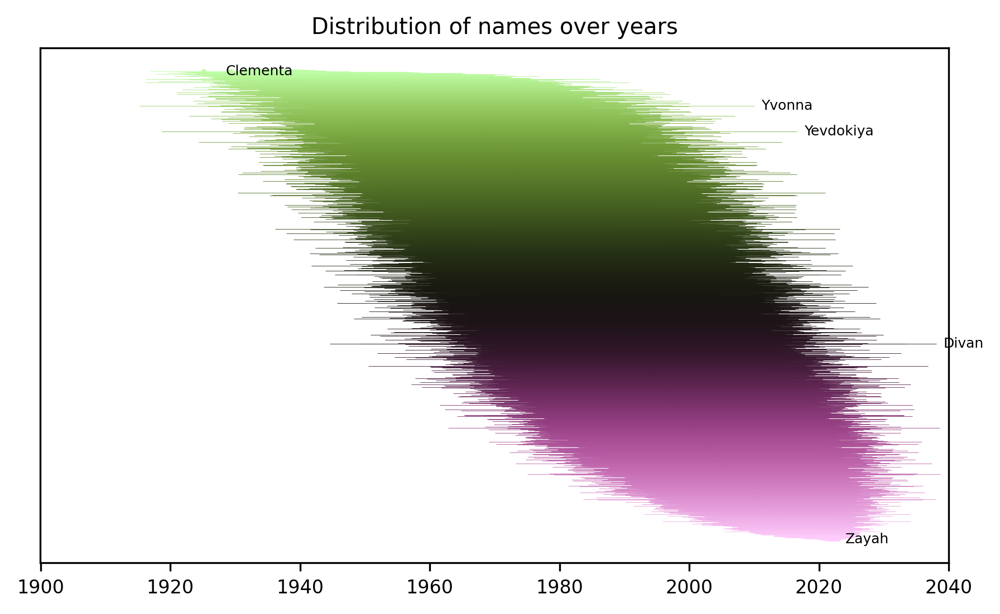
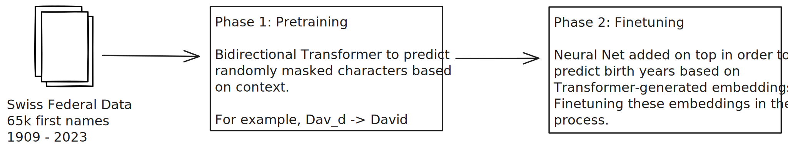
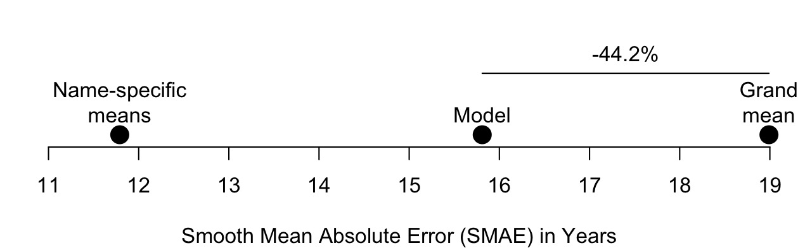

# AgePrediction
## Summary
While companies generally seek to better understand their customers to improve marketing efforts, such knowledge is often limited. For example, in B2C settings, information like customer age can be informative for key performance indicators such as retention rate, yet it is often unavailable. One possible solution is to estimate customer age based on first names: when parents choose a name for their child, they are influenced by time-specific trends. However, authoritative datasets are costly, may not cover all first names in a customer base, and often provide average birth years that may not accurately reflect the underlying distribution. Moreover, such datasets can become outdated and typically lack uncertainty estimates.

As an alternative, I present an approach that uses frequency data on 65,373 names from 1909 to 2023, provided by the Swiss Federal Statistical Office (https://www.bfs.admin.ch/asset/en/32208760). A model is trained to predict birth years based on names using a two-stage approach optimized for handling both common and rare names appropriately. The training process includes a pretraining and a finetuning stage. During pretraining, a bidirectional transformer with multiple attention layers learns character-level patterns in names through masked language modeling. During finetuning, these learned representations are combined using multiple aggregation strategies and fed to a regression head to predict the most likely birth year associated with a given name.

The trained model estimates birth years with a Smoothed Mean Absolute Error (SMAE) of 15.8 years. This error cannot be brought lower than 11.8 years on average, due to names typically recurring across multiple decades, which introduces irreducible estimation uncertainty. In comparison to a benchmark SMAE of 19.0 years (equivalent to predicting the population mean birth year for all names), this model achieves a 44.1% reduction in prediction error. The model demonstrates particular strength in handling frequency-weighted predictions, focusing learning on representative naming patterns rather than outliers, which is crucial for practical business applications.

Business applications include customer segmentation for targeted marketing, content personalization based on generational preferences, and retention analysis by age cohorts. The model can be readily validated using customer subsets with known demographics and integrated into existing customer analytics pipelines.

Further performance improvements are likely achievable by incorporating additional contextual data, such as customer behavior patterns, geographic information, or engagement metrics from digital services.

## Model specifics
### Pretraining
The pretraining stage employs masked language modeling on character sequences. Names are tokenized at the character level and randomly masked (20% masking probability), with the model learning to predict masked characters from bidirectional context. Tokens are encoded into trainable embedding vectors of dimension 128, combined with learnable positional embeddings. The architecture consists of 6 transformer encoder layers, each with 4 attention heads and a feedforward dimension of 128, incorporating layer normalization and dropout (p=0.1) for regularization.

After 150 training epochs using the Adam optimizer (lr=1e-4), the pretraining model achieves a Cross Entropy Loss of 1.37, corresponding to 24.6% accuracy at predicting masked characters. This represents a 14-fold improvement over random chance (1/57 ≈ 1.8%), demonstrating effective learning of character-level name patterns that capture phonetic, morphological, and cultural naming conventions across different time periods.

### Finetuning
The finetuning stage addresses the regression task through a sophisticated architecture designed to handle the complexity of name-to-year mapping. A multi-layer regression head is placed on top of the frozen pretrained transformer, consisting of 4 linear layers with ReLU activations and dropout, plus a residual connection to prevent vanishing gradients. After an initial warmup period allowing the regression head to stabilize, the top 2 transformer layers are unfrozen for task-specific fine-tuning when validation loss drops below 29.5.

Four complementary aggregation strategies process the transformer's sequence embeddings: 1) mean pooling for overall character patterns, 2) max pooling to capture distinctive features, 3) position-weighted pooling emphasizing name beginnings and endings, and 4) learned attention pooling to identify important character positions. This multi-strategy approach ensures robust feature extraction regardless of name length or structure.

To address data imbalance where popular names appear much more frequently than rare ones, the loss function incorporates frequency weighting (log1p normalization). This ensures the model learns from representative naming trends rather than overfitting to unusual name-year combinations. Additionally, a Combined Huber-Focal Loss provides robustness to outliers while focusing learning on difficult predictions.

Key training optimizations include gradient clipping (max_norm=1.0), learning rate scheduling with ReduceLROnPlateau, and early stopping (patience=30) to prevent overfitting. The final model balances accuracy on common names with reasonable performance on rare names, making it suitable for diverse customer bases.
